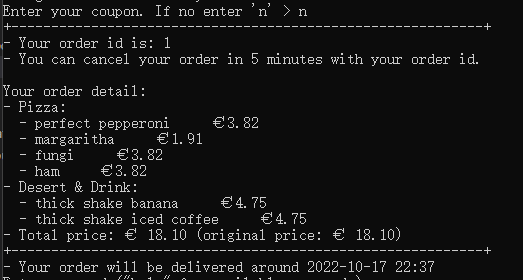
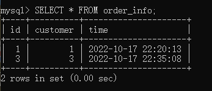
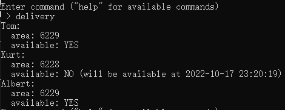
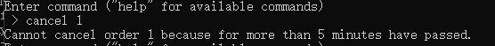

# Presentation Content:  

## The choices we’ve made:  
+ Database API: **pymysql**  
+ Programming paradigm: **OOP**  
+ Database system: **MySQL**  

## The database we created:
Run in MySQL:
+ `use pizza;`
+ `show tables;`   

### Tables sturcture:
+ `DESC pizza; DESC ingredient; DESC pizza_to_ingredient; DESC side_dish; DESC customer; DESC deliveryman; DESC order_info; DESC order_to_pizza; DESC order_to_side_dish; DESC coupon;`   
   

### Sample data:
+ `SELECT * FROM pizza;`
+ Pizzas information: `SELECT * FROM pizza JOIN pizza_to_ingredient ON pizza.id = pizza_to_ingredient.pizza JOIN ingredient ON ingredient.id = pizza_to_ingredient.ingredient;`
+ `SELECT * FROM side_dish;`   

## Our program's functionality:
### `help`: Shows all available commands   

### `menu`: Prints available pizzas, drinks and desserts   

+ There are 10 pizzas with 10 different ingredients, 4 drinks and 2 deserts as sample data.
+ It shows pizzas with their ingredients, and if it is **vegetarian**
  + This is implemented in `is_pizza_vegan()` in `database.py`
  + This method checks the *category* of each ingredient. If all the ingredients are vegetarian, it will label this pizza as vegetarian.
+ How we calculate **the price of a pizza**: `print_pizza()` in `database.py`  
  + We don't have price as a field of pizza
  + The price of a pizza = sum of ingridient's prices * 1.4 * 1.09 (tax)

### `order [items]`: Place a new order. Add items splitted by a single space.
#### Process:
1. Order pizza, drink and desert   
  
2. Store customer's information  
  
3. Use coupon and finish ordering   
  
+ It shows comfirmation with the **products** ordered and the **estimated delivery time**
+ Coupon is used to have 10% discount

#### Send coupon:
Run in MySQL: `SELECT * FROM customer WHERE id = 2;`   

Order more pizzas:   

#### Addition:
+ Order no pizza
  
+ Use used coupon
  
+ No delivery employee for your area:
  

### `cancel [order id]`: Cancel existing orders.
#### Status before cancelling:
+ All orders: `SELECT * FROM order_info;` (time: when was the order placed)
  
+ All deliverymen:
  `delivery`
  

#### Cancel an order:
+ Cancel an order that was placed five minutes ago
  
+ Cancel an order within five minutes
  

+ The relavant records in *order_info*,*order_to_pizza*, *order_to_side_dish* are all deleted.
+ Deliveryman's time is realeased
  
  + *available time of Kurt reduced 30 mins. He is not available because he is delivering order 1.*

### `delivery`: Check all deliverymen's status.
+ Several deliverymen: `SELECT * FROM deliveryman;`
  
+ Postcode: match the fist 4 digit with customer's postcode
+ Run command `delivery`. 
   
  + (will be available at xxx): When a pizza is ordered, if a delivery employee is available, his time will be blocked from now for 30 mins.

  + If there's no available delivery man for now, we will find the fastest one and block 30 mins after his current orders. The waiting time (the time he delivers other orders) is added in **estimated delivery time** of the order.
    
  *Now its 22:43, but the estimated delivery time is 30 mins + Kurt's next available time*
+ Place an order out of available area: A delivery person cannot deliver outside the area which is not assigned to them
+ Code implemented in `setup_delivery()` in `main.py`